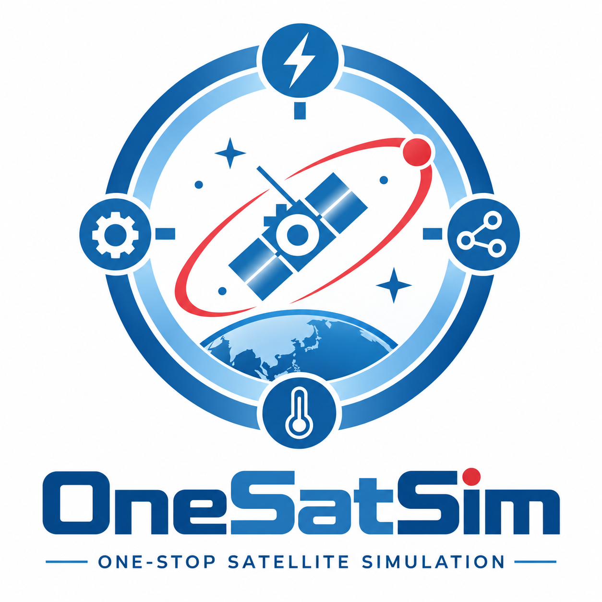
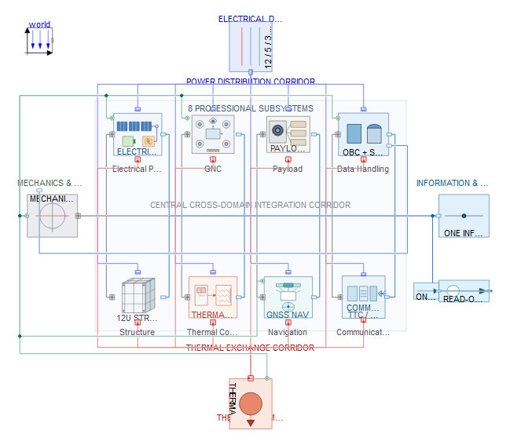

<div align="center">



# OneSatSim

### One-Stop Satellite Simulation · 一站式卫星总体仿真框架

**Modelica-based · Multi-domain · Mission-driven · Configurable · Extensible**  
**基于 Modelica · 多领域耦合 · 任务驱动 · 参数化配置 · 可二次开发**

[](https://modelica.org/)
[](https://openmodelica.org/)
[](https://www.tongyuan.cc/)
[](./OneSatSim_12UCubeSat_CaseStudy.html)

[中文介绍](#zh) · [English Overview](#en) · [案例手册 / Case Study](./OneSatSim_12UCubeSat_CaseStudy.html)

</div>

---

<a id="zh"></a>

## 1. 项目简介

**OneSatSim** 是一个基于 **Modelica** 的通用卫星系统级总体建模与仿真框架。项目名称来自 **One-Stop Satellite Simulation**：希望把卫星总体设计中原本分散在轨道、任务、电源、热控、姿态、载荷、数管、通信和资源预算中的分析工作，组织到**同一个可执行模型、同一条任务时间轴和同一套参数配置体系**中。

当前公开模型以 **12U 对地观测立方星**为基础案例，用于卫星总体设计、方案论证、任务—资源权衡、跨分系统耦合分析和二次开发。项目根包为 `OneSatSim`，当前版本为 `2.1.0`，基础模型依赖 **Modelica Standard Library 4.0.0**。

<div align="center">

<br>
<sub>OneSatSim 系统模型与总体架构</sub>
</div>

OneSatSim 采用清晰的 **“1 + 4 + 8”** 总体结构：

- **1 个完整任务仿真入口**：`Simulation.CompleteMission`
- **4 个跨设备总体网络**：机械、供电、热、信息
- **8 个卫星分系统**：电源、姿轨控、载荷、数管、通信、导航、热控、结构

OneSatSim 更关注卫星真正沿任务时间轴运行时的系统行为：轨道环境、姿态动作、设备开关机、供电、热状态、存储、通信窗口与任务调度能否在同一个系统模型中保持一致。

---

## 2. OneSatSim 可以做什么？

OneSatSim 主要面向卫星总体设计与系统级工程分析，可用于：

- **总体与多领域联合仿真**：统一分析机械、电气、热和信息域之间的耦合关系；
- **轨道与任务全过程分析**：结合真实日期环境、目标与地面站机会，执行成像、姿态机动、下传等任务；
- **任务—资源联合评估**：分析电池 SOC、功率、温度、飞轮、存储和数据吞吐等资源随任务变化的过程；
- **参数化方案研究**：通过配置快速修改轨道、任务、设备和资源参数，开展 What-if 与敏感性分析；
- **二次开发与安全研究**：作为控制算法、星务逻辑、故障注入、安全模式和更高保真模型的系统级基础。

OneSatSim 强调先建立**可运行、可解释、可修改**的总体模型，再根据具体研究目标逐步提高局部模型保真度。

---

## 3. 建模与参数化配置

OneSatSim 将卫星设备建模为可独立理解和替换的 Modelica 组件。典型设备可以同时具有机械、电源、热和信息接口，并通过 `Systems.SpacecraftSystem` 接入四大总体网络和八个分系统。这样，一次成像、姿态机动或下传任务能够同时反映设备状态、功率、热耗散、数据与资源变化。

推荐使用唯一完整仿真入口：

```modelica
OneSatSim.Simulation.CompleteMission
```

当前配置链为：

```text
DesignConfig.xlsx
        ↓
UpdateConfig.bat
        ↓
参数与单位检查 / 质量属性计算
        ↓
场景与硬件配置生成
        ↓
真实日期轨道与星历环境生成
        ↓
Simulation.CompleteMission
```

用户通常只需优先修改根目录中的 `DesignConfig.xlsx`，再运行 `UpdateConfig.bat`。生成流程会更新任务场景、硬件设计参数、质量属性和环境数据，使仿真结果能够追溯到明确的配置输入。

默认完整任务仿真设置为：

```text
StartTime       = 0 s
StopTime        = 86400 s
OutputInterval  = 1 s
Tolerance       = 1e-5
Solver          = IDA
```

---

## 4. 软件环境

### 4.1 OpenModelica

[OpenModelica](https://openmodelica.org/) 是**开源的 Modelica 建模与仿真环境**，可直接从官网下载安装。

- 官网：<https://openmodelica.org/>
- 官方下载：<https://openmodelica.org/download/>
- Windows 下载：<https://openmodelica.org/download/download-windows/>
- 官方用户手册：<https://openmodelica.org/doc/OpenModelicaUsersGuide/latest/>

OneSatSim 推荐使用 OpenModelica / OMEdit 进行模型检查、编译和仿真。

### 4.2 MWORKS.Sysplorer

[MWORKS.Sysplorer](https://www.tongyuan.cc/) 是商业闭源 Modelica 建模与仿真平台。

- 官方网站：<https://www.tongyuan.cc/>
- 产品下载：<https://www.tongyuan.cc/product/download>
- 许可配置说明：<https://www.tongyuan.cc/docs/sysplorer/2026a/Help/SetupHelp/Doc/SetupHelp/License.html>

中国高校在校生可使用符合要求的高校教育邮箱申请 **MWORKS 教育版许可**。具体申请资格、免费政策和许可期限请以官网当前规则为准。

---

## 5. 快速开始

### 5.1 克隆项目

```bash
git clone https://github.com/Ruizhe-Yang/OneSatSim.git
cd OneSatSim
```

### 5.2 安装配置工具依赖

```bash
python -m pip install -r tools/requirements-ephemeris.txt
```

### 5.3 更新配置

打开并修改：

```text
DesignConfig.xlsx
```

保存后在 Windows 下运行：

```text
UpdateConfig.bat
```

### 5.4 运行模型

在 OpenModelica / OMEdit 中打开根目录 `package.mo`，进入：

```text
OneSatSim
└─ Simulation
   └─ CompleteMission
```

先执行 **Check Model**，再编译和仿真。修改较多参数或模型后，建议先进行短时仿真，再运行完整任务时长。

---

## 6. 项目结构

```text
OneSatSim/
├─ package.mo
├─ package.order
├─ OneSatSim.png
├─ systems.png
├─ DesignConfig.xlsx
├─ UpdateConfig.bat
│
├─ Foundation/
│  ├─ Interfaces/        # 机、电、热、信息与任务接口
│  ├─ Models/            # 公共行为与任务核心模型
│  ├─ Calculations/      # 可复用计算模型
│  ├─ Functions/         # 编解码与辅助函数
│  └─ Types/             # 枚举、质量属性、遥测类型等
│
├─ Scenarios/            # 场景与设计配置
├─ Components/           # 设备级 Modelica 组件
│
├─ Systems/
│  ├─ Four_systems/      # 机械、电气、热、信息四大总体
│  ├─ N_systems/         # 八个分系统
│  └─ SpacecraftSystem.mo
│
├─ Simulation/
│  └─ CompleteMission.mo # 完整任务仿真入口
│
├─ Resources/            # 星历与环境资源
├─ tools/                # 配置、环境、检查与验证工具
└─ outputs/              # 配置审计与验证输出
```

---

## 7. 如何进行二次开发

OneSatSim 可以在现有总体架构上直接修改和替换局部模型，常见方式包括：

- **更换任务与整星参数**：在 `DesignConfig.xlsx` 中修改轨道、目标、地面站、设备功率、质量、安装位置、电池、太阳电池、存储和通信参数；
- **新增或替换设备模型**：保持接口语义一致时，可替换单个设备或分系统，而不必重建整星模型；
- **提高局部模型保真度**：可将等效功耗、集总热容、低阶姿态模型等逐步替换为更详细的物理模型；
- **接入外部模型或算法**：可根据所用 Modelica 工具的能力，将局部算法或部件替换为 **C 语言模块**、**FMU 模块**，也可继续接入新的控制算法、星务逻辑或联合仿真模型；
- **扩展故障与安全分析**：增加传感器失效、执行器退化、电源异常、热控异常、安全模式、故障注入和恢复逻辑等。

---

## 8. 两个重要的思路来源

### 8.1 《宇航学报》：机—电—热—信耦合的航天器系统级仿真方法

OneSatSim 的系统组织思想受到以下论文的重要启发：

> **彭坤，王岩，李智，翁昉倞，贾雨棽. 考虑机电热信耦合的航天器系统级分布式仿真方法研究[J]. 宇航学报, 2025, 46(9): 1896-1905.**  
> DOI: [10.3873/j.issn.1000-1328.2025.09.016](https://doi.org/10.3873/j.issn.1000-1328.2025.09.016)  
> 论文页面：<https://www.spacejournal.cn/yhxb/article/doi/10.3873/j.issn.1000-1328.2025.09.016>

该工作提出了面向航天器的 **“1 + 4 + N”** 系统级仿真结构，强调以单机为重要建模颗粒度，统一考虑机械、电气、热和信息耦合，并将总体模型、分系统模型和设备模型组织为完整的系统级仿真体系。

OneSatSim 吸收了其中的**分层组织、设备多域表达和跨系统耦合**思想，并在当前工程中形成四大总体网络、八个分系统和统一任务仿真入口。

### 8.2 “阿斯图友谊号” ASRTU-1 开源星务软件

OneSatSim 的任务逻辑、设备状态、星务信息组织和工程遥测设计还受到了 **ASRTU-1（阿斯图友谊号）开源星务软件**的启发。

该项目由**哈尔滨工业大学紫丁香学生微纳卫星团队**开发，并以 GPL-2.0 许可证公开：

- OpenLilacSat 开源平台：<https://gitee.com/openlilacsat>
- ASRTU-1 星务软件：<https://gitee.com/openlilacsat/ASRTU-1_OBC_Software>

公开星务程序包含任务调度、姿轨控接口、电源管理、故障处理和地面遥控等模块，为理解学生卫星的软件组织、任务流程、设备状态与工程信息提供了重要参考。

---

## 9. 适用边界

OneSatSim 面向卫星总体设计、任务—资源分析、多领域耦合研究、算法验证、教学科研与安全分析等系统级工作，其模型颗粒度服务于总体工程问题，而不是直接替代真实飞行软件、器件鉴定模型、结构有限元、CFD、电磁与射频电路级分析、热真空和整星环境试验，也不构成飞行认证或型号定型依据；使用时应明确区分公开参考值、工程假设、配置参数与仿真结果。

---

## 10. 致谢

特别感谢 **大连理工大学智连星宇学社** 对本项目相关工作的支持。

感谢在卫星系统工程、模型梳理、建模讨论、测试交流与开源实践中提供帮助的老师、同学和开源社区贡献者。

同时感谢：

- Modelica Association；
- 哈尔滨工业大学紫丁香学生微纳卫星团队 / OpenLilacSat；
- JPL、IERS 及相关科学数据与开源软件维护者。

---

## 11. 技术说明

更完整的模型结构、建模原理、参数说明、仿真结果与工程评价见：

**[OneSatSim 12U CubeSat Case Study](./OneSatSim_12UCubeSat_CaseStudy.html)**

---

## 12. 参与开发

欢迎基于 OneSatSim 开展新卫星模型、新设备与分系统模型、高保真模型替换、任务规划与控制算法、故障与安全模型、不同 Modelica 平台适配、结果可视化和教学案例等开发工作。

如果发现模型问题、接口问题或有新的功能建议，欢迎通过 GitHub Issues / Pull Requests 参与项目建设。

---

<a id="en"></a>

## 1. Overview

**OneSatSim** stands for **One-Stop Satellite Simulation**. It is a **Modelica-based system-level satellite modeling and simulation framework** designed to organize orbital environment, mission logic, power, thermal behavior, attitude control, payload, data handling, communication, and resource constraints within **one executable model, one mission timeline, and one configuration workflow**.

The current public baseline is built around a **12U Earth-observation CubeSat** and serves as an extensible foundation for spacecraft system design, concept evaluation, mission-resource trade studies, cross-subsystem analysis, and secondary development. The root package is `OneSatSim`, the current version is `2.1.0`, and the core dependency is **Modelica Standard Library 4.0.0**.

<div align="center">

<br>
<sub>OneSatSim system model and architecture</sub>
</div>

The framework follows a **1 + 4 + 8** organization:

- **1** complete mission simulation entry: `Simulation.CompleteMission`
- **4** cross-device overall networks: mechanics, electrical, thermal, and information
- **8** spacecraft subsystems: EPS, GNC, payload, data handling, communication, navigation, thermal control, and structure

OneSatSim focuses on whether mission activities, physical states, and resource constraints remain mutually consistent while the spacecraft actually executes its mission over time.

---

## 2. What can OneSatSim do?

OneSatSim supports:

- **system-level and multi-domain simulation** across mechanical, electrical, thermal, and information domains;
- **orbital and mission-process analysis** with real-epoch environments, imaging targets, ground stations, maneuvers, and downlink activities;
- **mission-resource evaluation** for SOC, power, temperature, reaction wheels, onboard storage, and data throughput;
- **parameterized design studies** through configurable spacecraft, orbit, mission, and resource parameters;
- **secondary development and safety studies**, including algorithms, onboard logic, fault injection, protection, and higher-fidelity subsystem models.

The project favors an **executable, explainable, and modifiable** system model first, with fidelity increased progressively where needed.

---

## 3. Modeling and configuration

OneSatSim represents spacecraft units as replaceable Modelica components with mechanical, power, thermal, and information interfaces. Components are organized through `Systems.SpacecraftSystem`, the four overall networks, and eight spacecraft subsystems so that a single mission action can affect device state, power, heat, data, and resources on the same timeline.

The recommended complete simulation entry is:

```modelica
OneSatSim.Simulation.CompleteMission
```

The configuration workflow is:

```text
DesignConfig.xlsx
        ↓
UpdateConfig.bat
        ↓
parameter / unit validation and mass-property calculation
        ↓
generated mission and spacecraft configuration
        ↓
real-epoch orbital and ephemeris environment generation
        ↓
Simulation.CompleteMission
```

Users normally edit `DesignConfig.xlsx` and run `UpdateConfig.bat`. The workflow updates mission settings, spacecraft parameters, mass properties, and environment data while keeping simulation inputs traceable.

Default complete-mission settings are:

```text
StartTime       = 0 s
StopTime        = 86400 s
OutputInterval  = 1 s
Tolerance       = 1e-5
Solver          = IDA
```

---

## 4. Software

### 4.1 OpenModelica

[OpenModelica](https://openmodelica.org/) is a **free and open-source Modelica modeling and simulation environment** and can be downloaded directly from its official website.

- Website: <https://openmodelica.org/>
- Download: <https://openmodelica.org/download/>
- Windows: <https://openmodelica.org/download/download-windows/>
- User Guide: <https://openmodelica.org/doc/OpenModelicaUsersGuide/latest/>

OpenModelica / OMEdit is the recommended reference environment for model checking, compilation, and simulation.

### 4.2 MWORKS.Sysplorer

[MWORKS.Sysplorer](https://www.tongyuan.cc/) is a commercial closed-source Modelica modeling and simulation platform.

- Website: <https://www.tongyuan.cc/>
- Download: <https://www.tongyuan.cc/product/download>
- License guide: <https://www.tongyuan.cc/docs/sysplorer/2026a/Help/SetupHelp/Doc/SetupHelp/License.html>

Students at Chinese universities can apply for an **educational license** using an eligible university email account. Eligibility, free-license policy, and validity period should be checked against the current official policy.

---

## 5. Quick start

Clone the repository:

```bash
git clone https://github.com/Ruizhe-Yang/OneSatSim.git
cd OneSatSim
```

Install the Python dependencies used by the configuration and ephemeris toolchain:

```bash
python -m pip install -r tools/requirements-ephemeris.txt
```

Edit:

```text
DesignConfig.xlsx
```

Then run on Windows:

```text
UpdateConfig.bat
```

Open `package.mo` in OpenModelica / OMEdit and run:

```text
OneSatSim.Simulation.CompleteMission
```

After major configuration or model changes, a short simulation is recommended before running the full mission duration.

---

## 6. Project structure

```text
OneSatSim/
├─ package.mo
├─ package.order
├─ OneSatSim.png
├─ systems.png
├─ DesignConfig.xlsx
├─ UpdateConfig.bat
│
├─ Foundation/
│  ├─ Interfaces/        # multi-domain and mission interfaces
│  ├─ Models/            # shared behavior and mission-core models
│  ├─ Calculations/      # reusable calculation models
│  ├─ Functions/         # encoding, decoding, and utilities
│  └─ Types/             # enumerations, mass properties, telemetry types
│
├─ Scenarios/            # mission and spacecraft configuration
├─ Components/           # device-level Modelica components
│
├─ Systems/
│  ├─ Four_systems/      # mechanics, electrical, thermal, information
│  ├─ N_systems/         # eight spacecraft subsystems
│  └─ SpacecraftSystem.mo
│
├─ Simulation/
│  └─ CompleteMission.mo # complete mission simulation entry
│
├─ Resources/            # ephemeris and environment resources
├─ tools/                # generation, validation, and test utilities
└─ outputs/              # configuration audit and validation outputs
```

---

## 7. Secondary development

OneSatSim can be extended by modifying or replacing local parts of the existing system architecture:

- **change mission and spacecraft parameters** in `DesignConfig.xlsx`;
- **add or replace components and subsystems** while keeping interface semantics consistent;
- **increase local fidelity** by replacing simplified power, thermal, attitude, communication, or other models;
- **connect external models or algorithms**, including replacing local functions or components with **C-language modules** or **FMU modules** where supported by the selected Modelica toolchain;
- **extend fault and safety analysis** with degraded modes, protection logic, safe-mode transitions, fault injection, and recovery behavior.

---

## 8. Two important sources of inspiration

### 8.1 Spacecraft system-level simulation with mechanical-electrical-thermal-information coupling

A major methodological inspiration is:

> **Peng Kun, Wang Yan, Li Zhi, Weng Fangjing, Jia Yuchen. Research on System-level Distributed Simulation Method for Spacecraft Considering the Coupling of Mechanical, Electrical, Thermal, and Information Systems. Journal of Astronautics, 2025, 46(9): 1896-1905.**  
> DOI: [10.3873/j.issn.1000-1328.2025.09.016](https://doi.org/10.3873/j.issn.1000-1328.2025.09.016)  
> Article: <https://www.spacejournal.cn/yhxb/article/doi/10.3873/j.issn.1000-1328.2025.09.016>

The paper proposes a **1 + 4 + N** spacecraft system-level simulation architecture, emphasizing device-level modeling, mechanical-electrical-thermal-information coupling, and the organization of overall, subsystem, and equipment models.

OneSatSim adopts the ideas of **hierarchical organization, device-level multi-domain representation, and cross-system coupling**, implemented through four overall networks, eight spacecraft subsystems, and a unified mission simulation entry.

### 8.2 ASRTU-1 open-source onboard computer software

Another important engineering reference is the open-source onboard computer software of **ASRTU-1 (ASRTU Friendship MicroSat)** developed by the **LilacSat Student Satellite Team at Harbin Institute of Technology**.

- OpenLilacSat: <https://gitee.com/openlilacsat>
- ASRTU-1 OBC Software: <https://gitee.com/openlilacsat/ASRTU-1_OBC_Software>

The public software includes mission scheduling, attitude-control interfaces, power management, fault handling, and ground-command functions, providing a useful engineering reference for spacecraft mission logic, device states, and onboard information organization.

---

## 9. Scope and limitations

OneSatSim is intended for system-level spacecraft design, mission-resource analysis, multi-domain coupling studies, algorithm evaluation, education, research, and safety-analysis model development. Its modeling fidelity is chosen for system engineering studies and does not replace flight software, component qualification models, structural FEM, CFD, electromagnetic or RF circuit-level analysis, thermal-vacuum or spacecraft environmental testing, or flight certification; reference data, engineering assumptions, configuration parameters, and simulation results should therefore be distinguished clearly.

---

## 10. Acknowledgements

Special thanks to the **Zhilian Xingyu Student Society of Dalian University of Technology (大连理工大学智连星宇学社)** for supporting the related work.

We also acknowledge:

- the Modelica Association;
- the HIT LilacSat / OpenLilacSat team;
- JPL, IERS, and the maintainers of the scientific data and open-source dependencies used by the project.

---

## 11. Technical report

For detailed model descriptions, implementation notes, simulation results, and engineering interpretation, see:

**[OneSatSim 12U CubeSat Case Study](./OneSatSim_12UCubeSat_CaseStudy.html)**

---

## 12. Contributing

Contributions are welcome in areas including new spacecraft models, component and subsystem development, higher-fidelity model replacement, mission-planning and control algorithms, fault and safety models, Modelica-tool compatibility, visualization, post-processing, and educational examples.

If you find model or interface issues, or have ideas for new features, please use GitHub Issues or Pull Requests to contribute.

---

<div align="center">

**OneSatSim — Put the satellite mission, physics, software logic, and resources on one timeline.**

**OneSatSim —— 把卫星任务、物理状态、软件逻辑与资源约束放到同一条时间轴上。**

</div>
